# 适用于毕业论文的word排版技巧

## 写在前面

笔者是电子科技大学物理学院2015级的本科生，某陈姓同学，同学们更多的叫我彩云老师。

这个文档写的十分匆忙，如果有错误可以直接在 <https://github.com/CuiaCuiSha/UseWordInThesis> 提出。谢谢你的支持。


如果你是一个能熟练使用 LaTeX 、Word ，请点击右上角的叉叉，因为本文所涉及的内容的确很基础。

如果你 word 排版上总是遇见困难，看完本文后可能会有所收获。

特别是对于毕业论文排版，会有很大的帮助。


作为一个强迫症，饱受毕设论文的排版工作的摧残，因此特地总结了正规的适用于毕业论文排版流程，留给后面的学弟学妹们参考。虽然是按照电子科技大学本科毕业模板及规范讲述的，不过也同样适用于中国的绝大多数高校。

看完本文之后可以使你的 word 技巧提高一点，让你不单单只是会粗暴的调字体大小，依靠空格、回车调整全文格式。

必须要说明，对于有能力的同学，鼓励使用 LaTeX 进行排版，推动全校 LaTeX 广泛应用刻不容缓！！

笔者最初也是想用 LaTeX 排版毕业论文，奈何学院教务科规定，查重的论文必须是 word 格式（后来发现，可以利用 pandoc 输出）；考虑到造福后人，毅然决然的放弃了熟练的 LaTeX，走上了使用 word 的不归路。

一番摸索，初具心得，特与君享，不当之处，烦请包涵。


## 1. 软件环境

- Microsoft Office 2016
- 公式编辑器——AxMath
- 公式图片转换LaTeX代码——MathPix

#### Office的选用

请不要用 WPS！请不要用 WPS！请不要用 WPS！WPS 很好用，但是和 office 偶尔存在部分不兼容的问题。

请使用 office2016 及其更高版本。

#### 疯狂安利 AxMath 编辑器（没收广告费也要安利）

下载地址 <http://www.amyxun.com/>

正版只要36元，即使用非注册版，也只会限制公式编辑器内的复制粘贴，对毕业论文没有任何影响（手头宽裕的同学建议入手一个）。

使用了一次之后，你会享受 AxMath 输入公式的快感，再也不想用回Mathtype。

AxMath 还可以帮助你在快速的将公式转换为 LaTex 代码，具体可以参考 AxMath 的帮助文档（AxMath是中国人开发的，帮助文档也是中文的十分友好）。

> Mathtype的中国代理商真的是臭名昭著。

#### 关于 MathPix

 下载地址<https://mathpix.com/>

论文写作中，总是会遇到一大堆已有的公式，但是这部分公式通常又是以图片的形式展示出来，自己手码又太累了，这款神器完美帮你解决这个问题。AxMath 支持直接粘贴 LaTeX 代码。


------

## 2. 关于 word 的部分功能简介

### 2.1 使用前的准备

- 导航窗格
- 标尺
- 显示所有标识符

导航窗格，可以用 Ctrl+F 键唤出，或者如下图。

标尺也按照下图方式唤出。

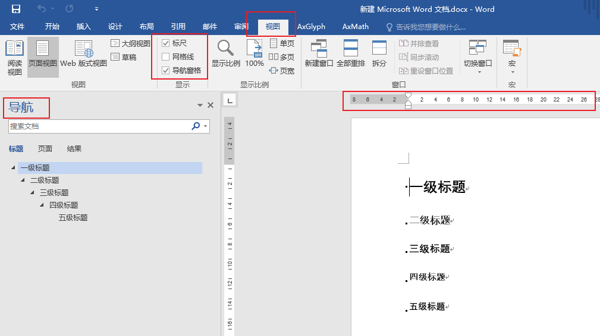

**显示所有的标识符**

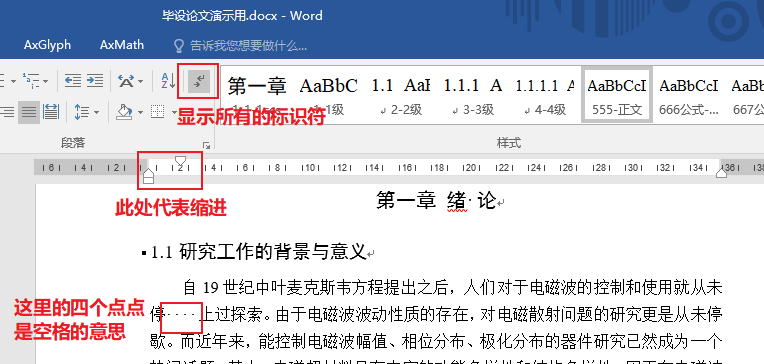


### 2.2 排版的重要功能--样式

对于任意新建的一个 word 文档，在正式使用之前，请大家注意图中的红框部分——**样式**

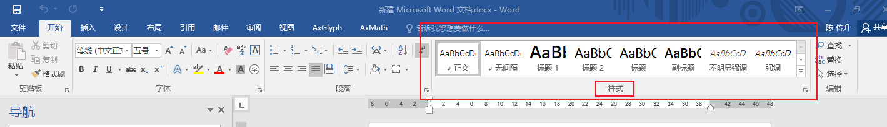

我们后续的绝大多数操作都时建立在**样式**的基础上进行的，借助于样式我们实现了**内容**与**格式**的分离。

文本内容较少时，样式的意义更多的在于导出 PDF 的时候能直接为我们生成书签，便于浏览。

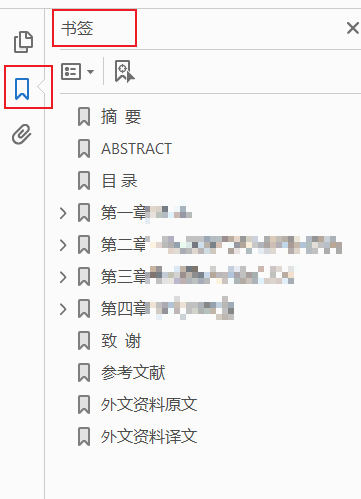

应用于毕业论文中的时，他的重要性在于自动生成目录，以及后续对于格式的统一调整。

举例，如果你突然发现，图题全部要求用黑体，但是你之前用的都是宋体，你该何去何从？最笨方法一个个改、一般笨方法格式刷，但是借助样式，只需要操作一次，所有的应用此样式的段落都可以自动更改。

#### 2.2.1 创建样式

Word 中自带的样式可以满足记录性文档的简单需求；但是毕业论文，自己定义样式是必不可少的。

创建方法如下

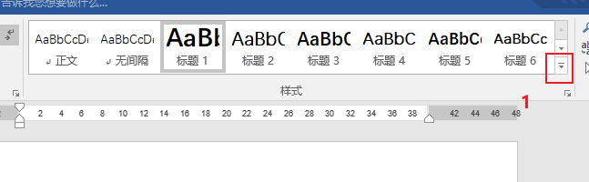


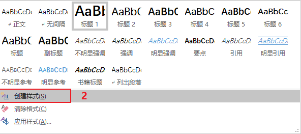

#### 2.2.2 修改样式

##### 基本操作

新建了样式后，对样式进行设置。右键点击，选择修改。

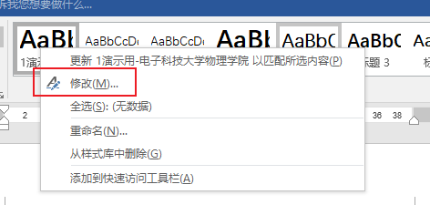

打开了修改样式的子框

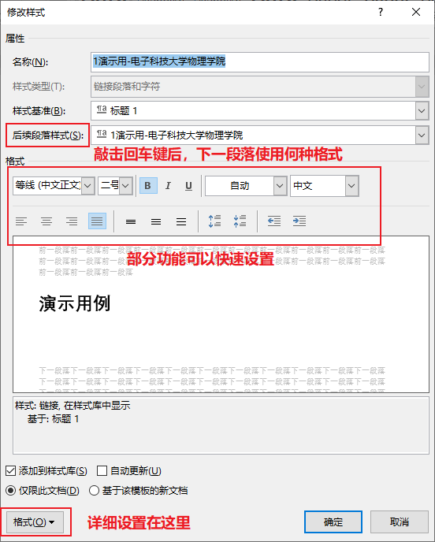


有必要说明，**后续段落样式**的意义在于，

- 插入图片后，图片设置为图所使用的样式；
- 敲击回车输入图题，图题默认使用图题样式；
- 敲击回车输入正文，正文默认使用正文样式；

为减少无意义的操作，如果你愿意一行行设置，那么这个功能忽略也可以。


##### 字体

设置方法：修改样式框---格式---字体

借助于字体，可以对中英文字体分别设置，毕业论文中，中文宋体，西文 Time News Roman。

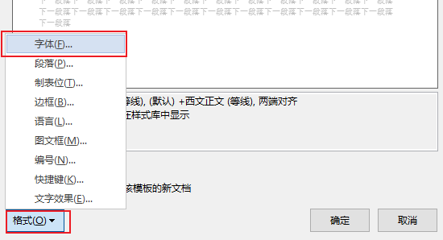

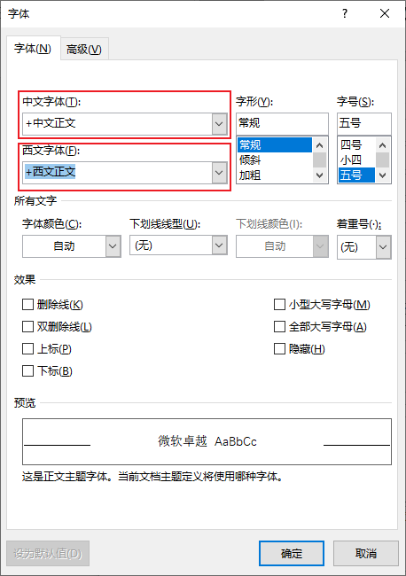


##### 大纲级别，段前段后间距，行距、缩进

设置方法：修改样式框---格式---段落

根据要求设置段前段后间距、行间距、以及缩进。

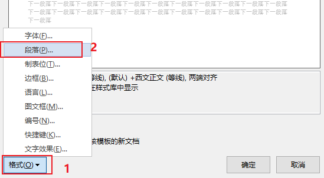


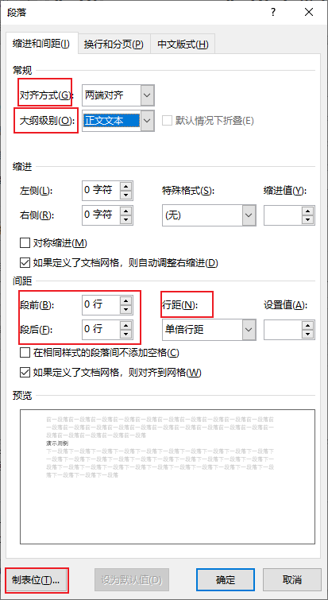


**大纲级别--标题等级**

最重要的设置之一，这个设置对于目录的生成至关重要！！

章节设为一级标题；节标题设为二级标题；依此类推。Word 中一般默认有九个级别再加正文文本。实际中四、五级已经足够使用了。

**关于缩进必须要强调的**

很多时候我们对 **Tab** 键和 **Space** 键混用，不加以区分，导致时而能对齐，时而对不齐。

此处不详细介绍，有兴趣的自己可以百度以下。

这里直接说我的设置，正文样式设置缩进固定两字符，全文不使用空格调整版式。


**如何判断自己是空格还是缩进？**

上图所示，显示所有标识符，空格会以灰色点的形式显示，缩进则没有；段落缩进再标尺中观察。


##### 制表位

关于制表位的使用，请参考 **3.2.3 公式的编号右对齐问题**。


 **样式设置小技巧**

右键样式---更新以匹配。用来快速设置样式的格式。

实现的结果，将当前选中内容的**格式**，设置为**样式**的**格式**。这里的格式包括字体，行间距，段落、缩进、制表符、等一系列看的见或看不见的设置！

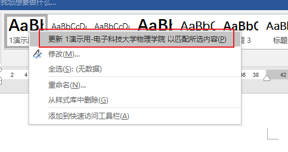


------

## 3. 毕业论文各部分设置

### 3.1 图、图题

借助样式，对插入的图片，图题分别创建特定的样式。

- 图片样式关键设置：居中，无缩进，**行距单倍**，段前段后间距，后续样式为图题。
- 图题样式关键设置：居中，无缩进，**字号**，段前段后间距，后续样式为正文。

#### 3.1.1 插入图片不显示

插入图片的格式，可以是插入为图片，也可以以**对象**的形式插入。关于**对象**的应用技巧较为复杂，这里不过多介绍，只介绍以纯图片的形式插入。

从别处复制图片之后右键，选择如图。

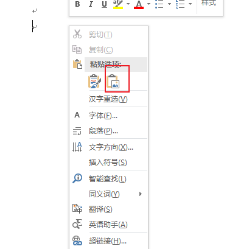

你可能遇到下列情况

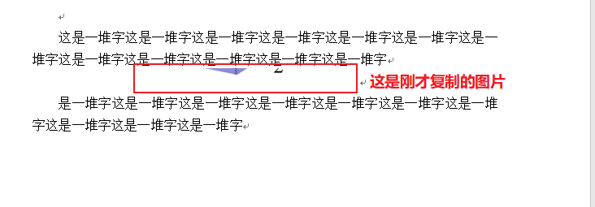

出现这这种情况的原因是，**正文样式**设置的是固定行间距，不论你的图片有多大，如果样式选择了正文，都会只有20磅的间距供你使用；因此对**图片单独设置一个样式**是很有必要的。

已插入的图片，设置为嵌入型，防止图片上下乱窜~~

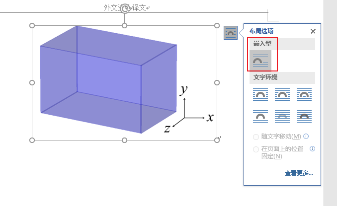


#### 3.1.2  图题设置

根据要求，单独为图题设置样式即可。

### 3.2 公式

#### 3.2.1 公式的插入

科普，公式的插入是存在区别的，在 LaTeX 中，公式分为行内公式和行间公式。

字面意思行内，在一行内；行间，在两行间。Word 没有详细区分，不过多学点总不是坏处。


**展示开始**，这是一个行内公式$$y=f(x)$$啊，公式被包含在文字中。

下面是一个行间公式
$$
e^{i\pi}+1=0
$$
**展示结束**了嘿嘿嘿。


#### 3.2.2 行内公式和文字不能对齐

对于行间公式，很多同学在用 mathtype 的时候会遇到，行内公式文字不对齐，上下漂移。

**解决方法**

1. 删了重打，百试百灵，工作量虽然巨大，不过也不是不可能。。。。

2. 放弃mathtype，使用 AxMath，可以完美避免哦，AxMath 的官方文档给出了操作方法

下图是 AxMath 的 word 插件格式，其中可以利用 **Ctrl+Shift+Q** 快速插入行内公式； **Alt+Q** 快速插入行间公式。


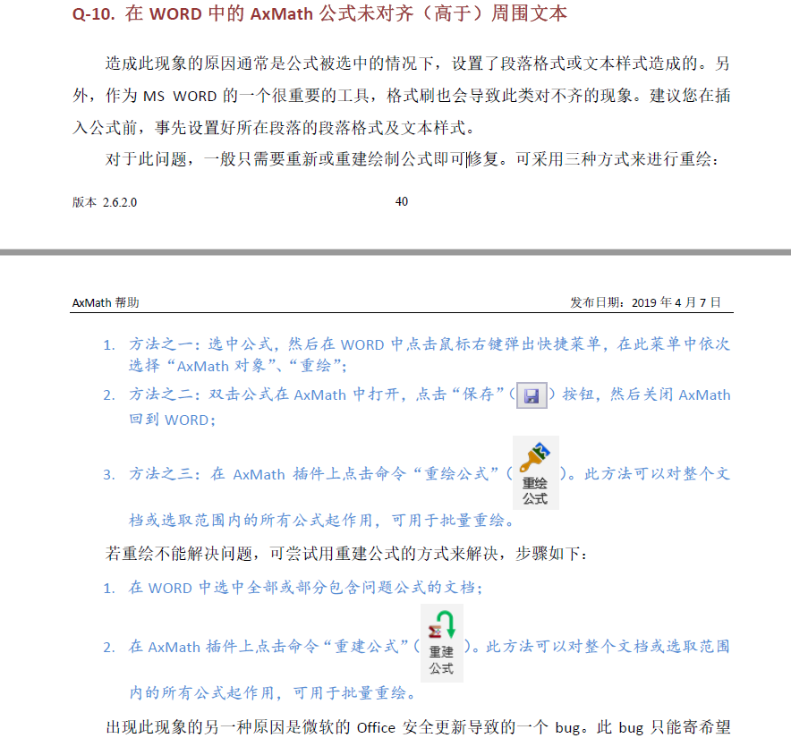


#### 3.2.3 公式的编号右对齐问题

论文中总是要求，公式居中，编号靠右。如何实现这个功能？

AxMath 中自带了右编号公式，也可以使用。这里讲解更通用的做法（万能的）。

两个方法：一种方法是利用表格，另一种方法是借助制表位，这里只讲解第二种方法，利用制表位。

为公式设置一个单独样式，设置重点：无缩进，行距1倍，段前段后6磅。

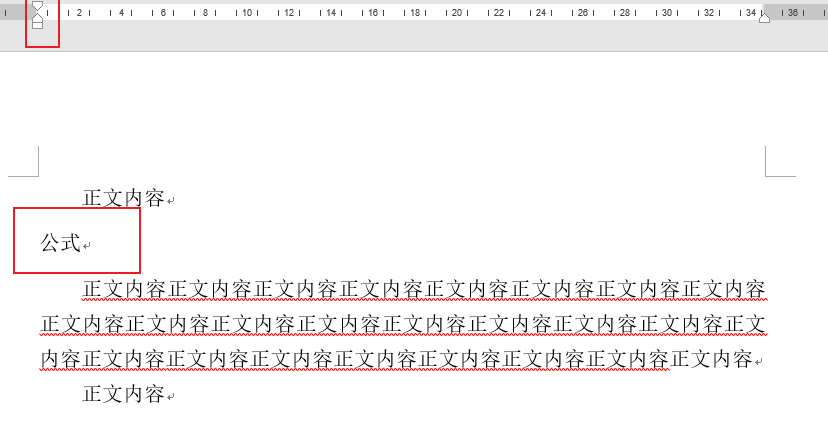


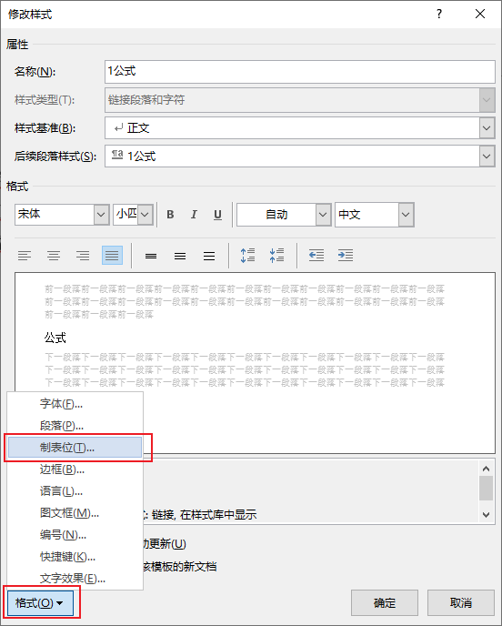


打开制表位，设置两个制表符。

- 操作顺序如图
- 17.5 字符，对齐方式选择**居中**；
- 35 字符，对齐方式选择**右对齐**；
- 确定键保存

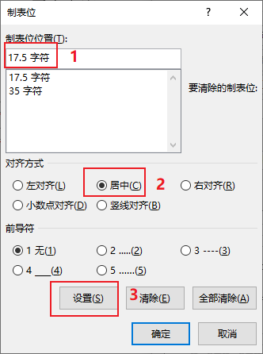

设置好之后，对于应用了**公式样式**的段落，可以观察到下图，标尺上两个新增的灰色样式，就是制表位了。


实际使用的操作过程

1. 选中空白行，应用公式样式。

2. 利用 AxMath 输入一个公式，手动输入一个编号。光标移动到公式前，按下 **Tab** 键。

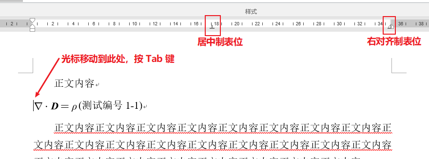


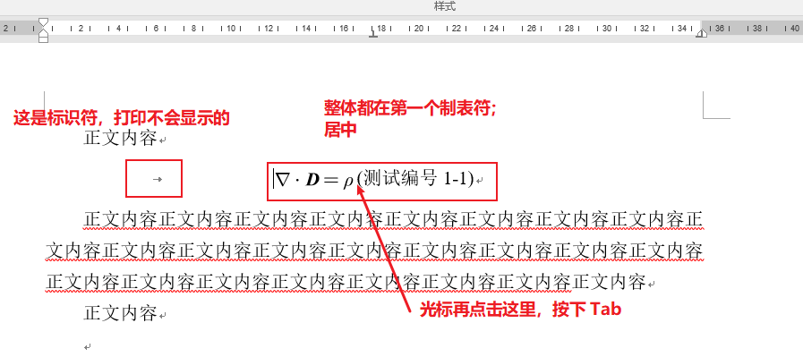

3. 光标移动到编号前，再次按下 **Tab** 键，

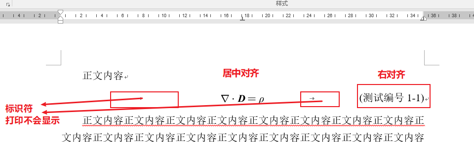

4. 大功告成。

#### 


### 3.3 交叉引用处理各种编号问题

*“如图 3-1，公式 2-15所示”*，这可能是论文中见到的最多的话。但是一个成熟论文总是要经过若干次的修改。

> 麻烦你再xx图之前，增加一个xx图。

图少，公式少的情况还好处理，一个个修改编号即可.若是碰到笔者这种，公式图片上百个这种情况，改起来怕是头都要炸了；若是不同地方，补充不同数量的图，真的是哔了狗的感觉。

基于此，我们必须要介绍 word 自带的一对功能，**插入题注**和**交叉引用**，具体位置如下：


#### 3.3.1 设置题注

对不同的类别，我们单独设立不同的题注，以方便区分编号。可以按照图，表，公式分别设置。新建标签即可

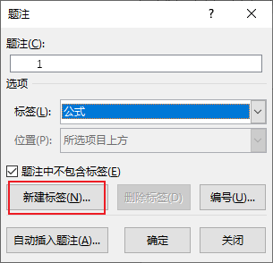

新建一个标签之后，对于是否包含标签，根据你的使用习惯而定

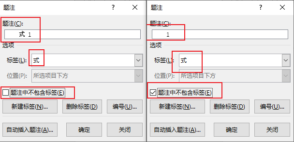

**在编号选项中，可以选择挟带章节编号，不过这里我们不建议使用；因为使用章节编号的前提，还要为样式设置对应的多级编号。操作较为复杂。**

因此我们只利用他实现最简单的分类排序，对不同的类别，设置不同的标签。

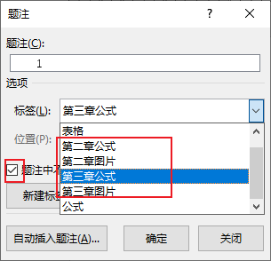

插入题注之后，类似于下图

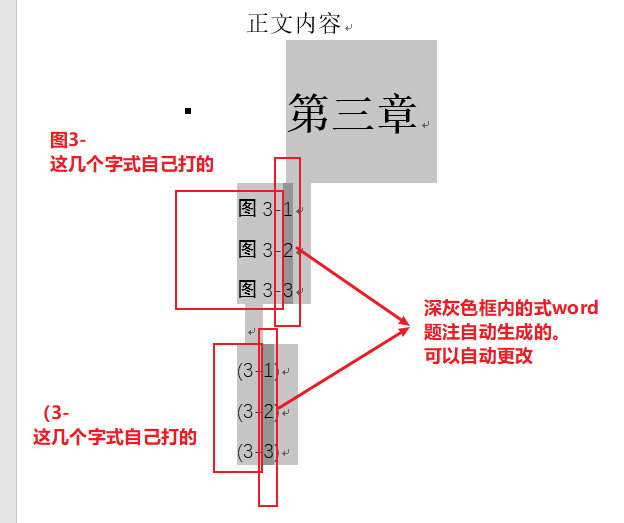

深灰色框借助了“域”的功能实现自动编号。例如在图3-1前再插入一个图

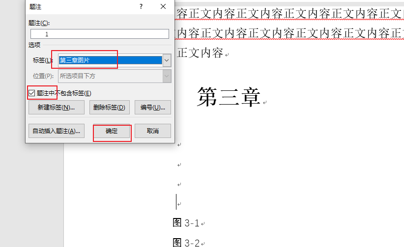

点击确定，会发现图的编号自动改变了。

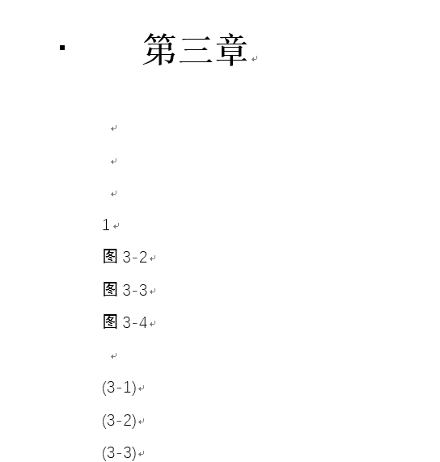

**划重点！！**当前页面内的编号都会自动更改，但是如果你有几十同一个题注下的编号，分布在文档的各个部分，很大概率不会自动更改，这里就要，用到**更新域**功能。

更新域的操作方法。选中文本，右键鼠标即可。

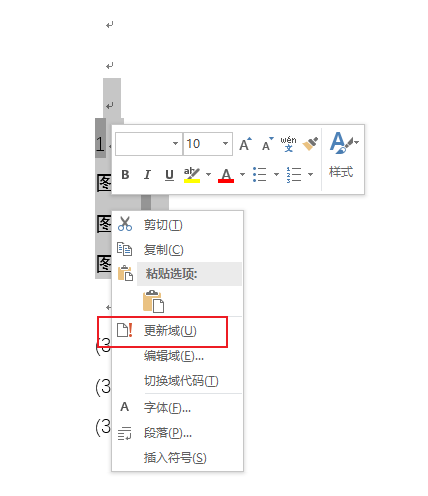


当你框选的文本过多，其中包含了图片，公式等一系列其他对象时，可能不会出现更新域的选项。

**解决方法**：可以借助 **F4** 键完成。Word 中 **F4** 的功能是**重复上一次操作**。这个操作可以是任何操作，比如删除、加粗、倾斜、设置图片大小、更新域等等。

- 选中一小行，使用更新域功能。
- 选中一大段，按**F4**。
- ok。

借助交叉引用可以处理，参考文献、图、表、公式等一系列编号问题。

#### 3.3.2 交叉引用

正文中需要引用的地方，1234按顺序操作即可。

引用类型和题注的类别是一样的，根据你自己划分的选择。

引用内容一般都是使用**只有标签和编号**。

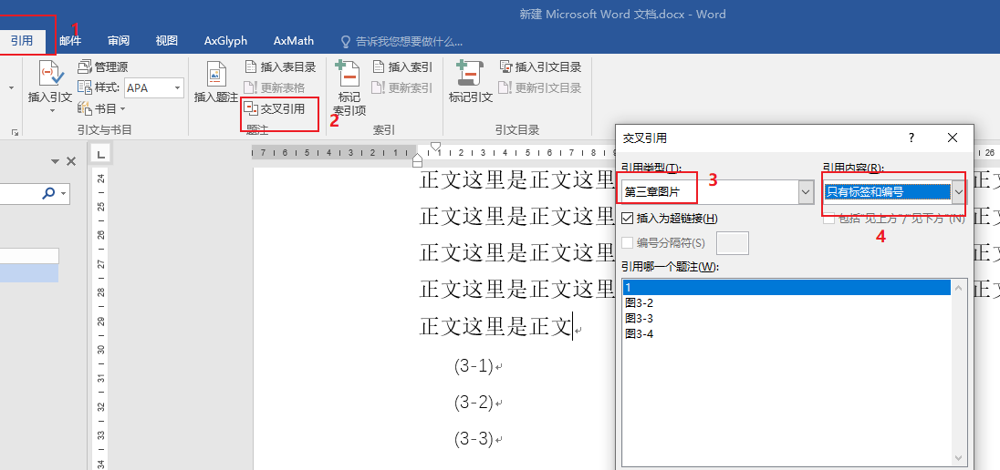

### 3.4 页眉、页脚、页码

#### 3.4.1 "Word" 中节的定义

编辑页眉页脚前，必须明确 word 中有节的定义。双击页眉页脚，可以看到上面是第二节，下面是第三节。

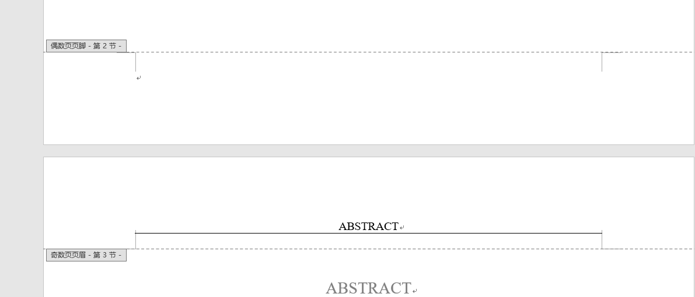


正如字体是按照**样式**与**内容**分开；页眉页码是按照**节**和**奇偶页**来划分不同的。

#### 3.4.2 如何设置节的划分

请确保打开了**显示标识符**的设置，具体参见 **2.1 使用前的准备**

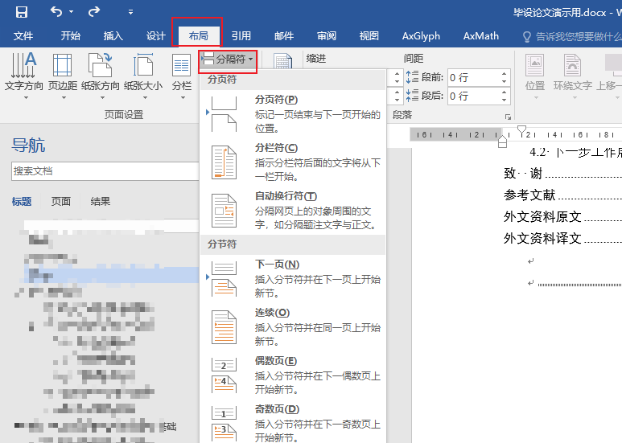

布局中的分隔符就是用来设置节。

- 第1个，分页符只分页，不分节。快捷键**ctrl+enter**
- 第4~7个都是分节符，都会起到分节的效果。写的已经很清楚了，就不解释了。


#### 3.4.3 中英摘要、目录页眉页脚设置

电子科技大学学位论文要求：

- 中英摘要及目录，页脚用罗马数字；页眉为摘要、Abstract、目录，都必须起始于奇数页，**不编排的页面不计入页数。**参加下图。不可避免地，你可能遇到下图这种尴尬情况。
- 正文重新开始页码，阿拉伯数字，偶数页页眉为“电子科技大学学士论文”，奇数页页眉为“章节标题”。

学校给的官方模板自身都有问题，这里就不去吐槽了。

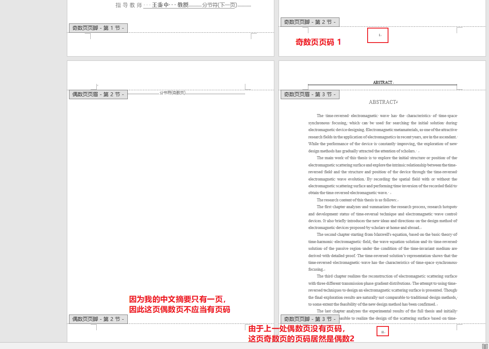

设置过程中，必须要强调**奇偶页页眉要分别设置！** **奇偶页页眉要分别设置！** **奇偶页页眉要分别设置！** **重要的话说3遍！！！！！**

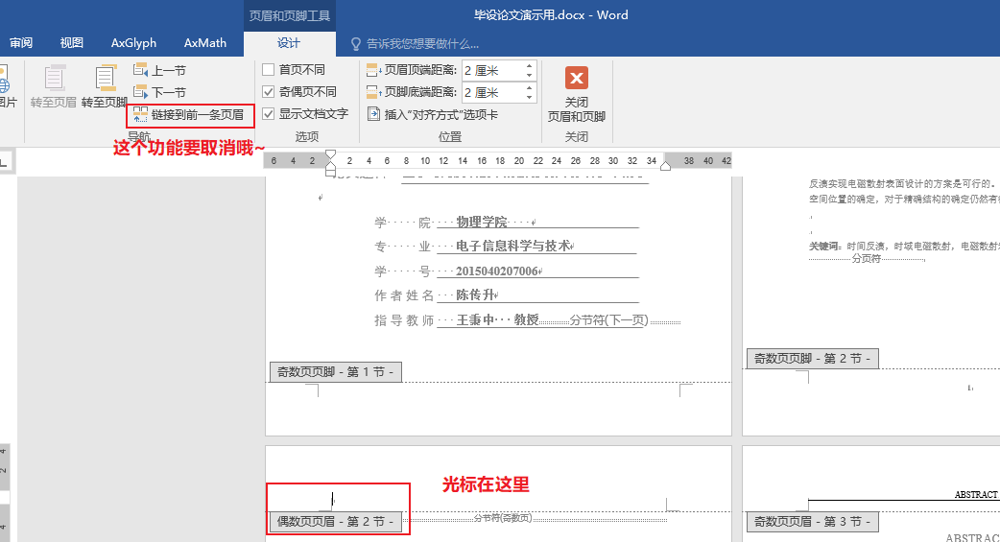

笔者能力有限，选用了最笨的方法，对于前几页页码要单独设置，页眉、页脚分别设置，罗马数字、字号、居中所有参数都是手调的~笨方法还是挺有效的。**前几页所有的都要取消链接！！！！！**

#### 3.4.4 正文页眉设置

- 正文起始于奇数页
- 阿拉伯数字1开始编码
- 每章必须开始于新的一页（不要求奇偶页限制）

双击第一章的页眉，确保以下两件事

- 与目录不处于同一节。目录之后插入了分节符。
- 取消链接到前一条页眉。**注意奇偶页分别取消链接。**

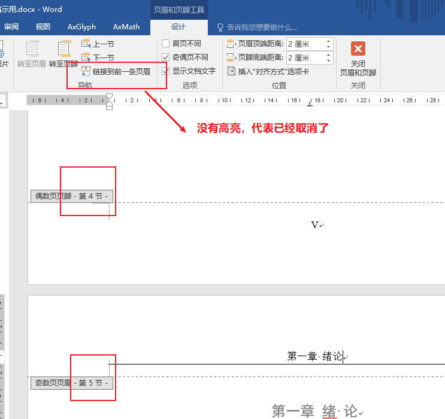


设置方式有两种：

- 笨方法：每个章节设置一个分节，单独设置页眉页脚。

  - 每一章单独设置分节，只需要**奇数页页眉取消链接到前一条**即可。

  - 每章之后记得插入分节符，分节符插入见**3.4.2 如何设置节的划分**

  

- 自动化方法，利用域，自动匹配。

  第一章之后的所有内容均位于同一节中。章节之后**只插入分页符**，不使用分节符。

  偶数页页眉自己手打一个即可“电子科技大学学士学位论文”。

  奇数页页眉。操作如下，插入--文本部件--域

  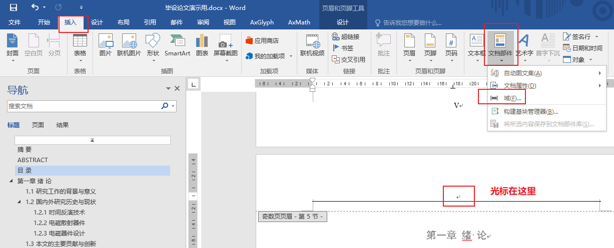

选择StyleRef，选中章节名对应的标题名，这里是1-1级

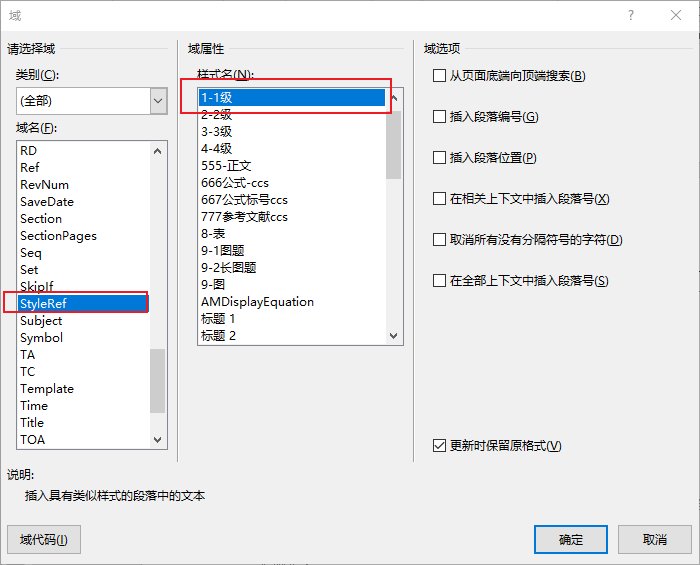

之后所有奇数页的页眉就完全自动匹配了。


#### 3.4.5 正文页脚

双击页脚。**注意！！！！**奇偶页都要和**目录**所在的**节**取消链接

只需要再第一章首页，设置页码格式为阿拉伯数字，起始页码为1。


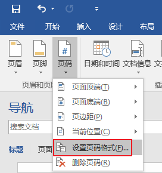

然后插入页码即可。

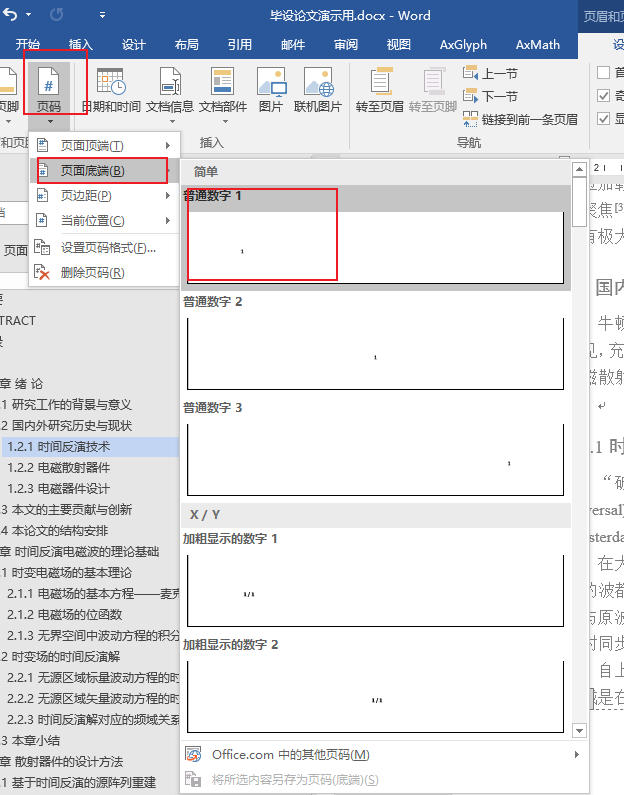

偶数页只要重复插入页码操作即可。

利用居中操作、或者制表符调节。奇数页调节一次，偶数页调节一次即可。


### 3.5 目录

#### 3.5.1 插入目录

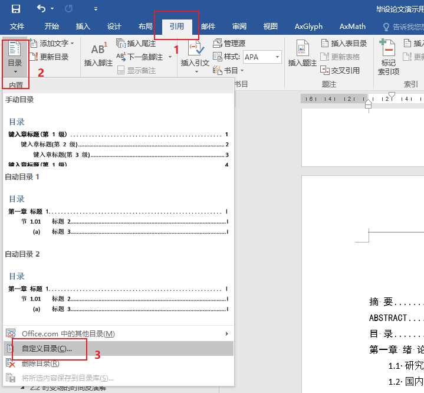

然后设置，一般默认都是三级。

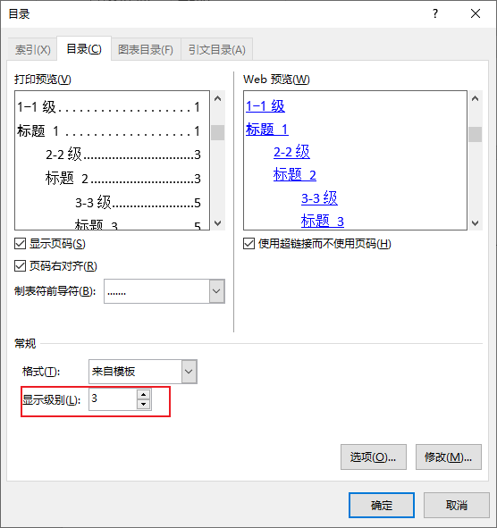


#### 3.5.2 更新目录

看图

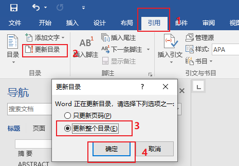

--------------------------------------------------

## 4. 打印输出

打印店的Word版本不一定和我们一致，若是被谁用WPS打开，所以最终打印的时候还是建议大家导出为pdf格式进行打印。

操作方式如图：

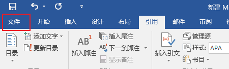


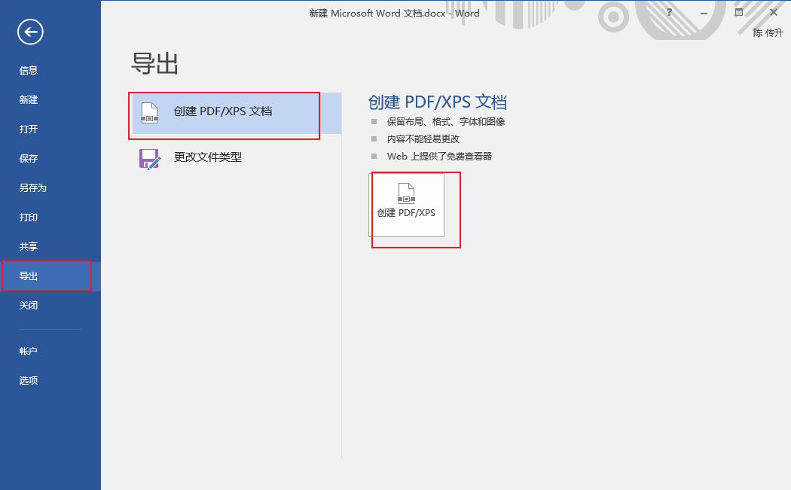

----------------

## 5. 其他

#### 5.1 章节自动编号问题

章节标题没有设置自动编号，虽然多级编号设置并不算难，但是考虑到有摘要、目录、致谢等一级标题并不需要编号，设置起来较为繁琐，需要的可以百度自行学习。

#### 5.2 公式交叉引用有bug

交叉引用公式出现bug，可以利用格式分隔符，在图示位置处插入即可。

格式分隔符的插入方式是 **Ctrl+Alt+Enter**


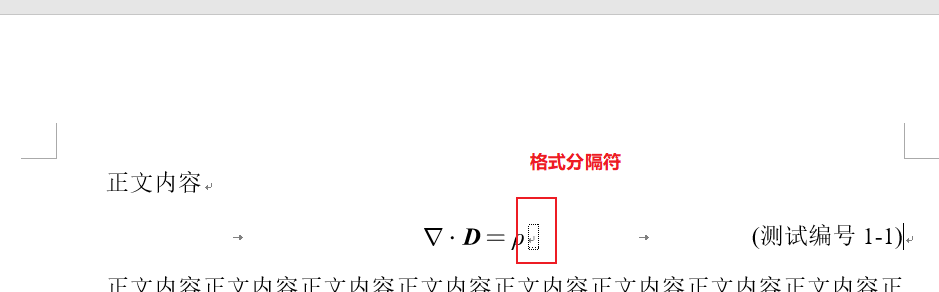


#### 5.3 PDF导出时，交叉引用报错或者有乱码

这时因为你的交叉引用使用不规范，设置题注1，引用题注1，删除题注1，引用却还保留着，在导出PDF时自然会报错。

解决方法：

- 正确的修改交叉引用，使用过程中规范使用。
- 锁定域，PDF 导出时禁止刷新域。


**Ctrl+A** 全选文章；再按**Ctrl+F11**锁定域，此时选中域右键单击，发现不可更新，这样打印就不会有问题了。

如果后续需要修改，**Ctrl+A** 全选文章；再按**Ctrl+Shift+F11**解锁域，就ok了。

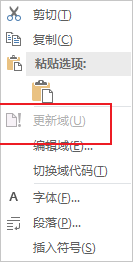

-------------------------------------

## 6. 没收广告费也要安利的AxMath

中文帮助文档，简单明了。你遇到的所有问题都能得到解决。

正版不贵36，即使使用非注册版，功能页局限的很少。

处理公式对不起文本的问题，可见**3.2.2**。


快速输入公式，借助简单的 LaTeX 代码快速输入公式，复杂的公式也可以通过面板输入。

这部分功能是完全开放的，不论你是否充值了36块钱，都能使用这个功能的。


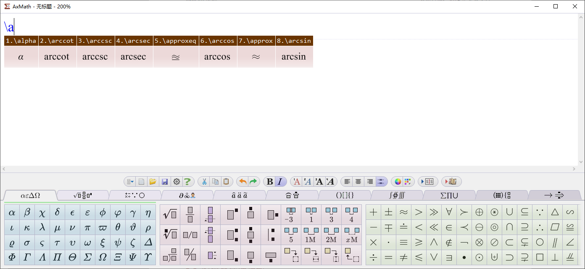

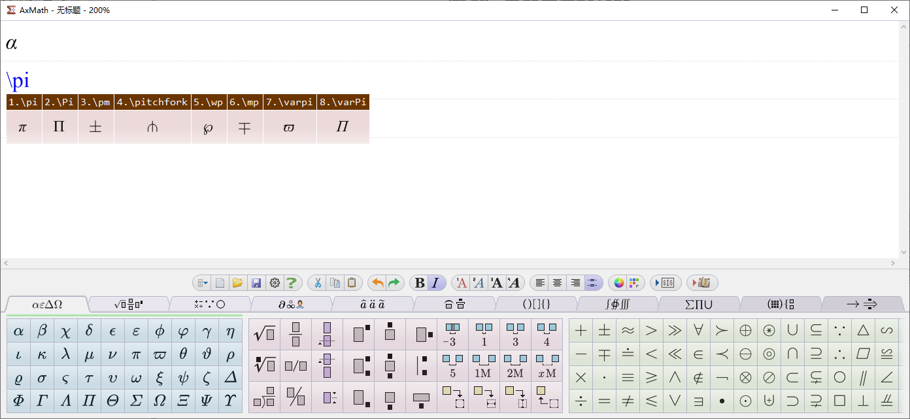


-------------------------------------------

## 7. 关于LaTeX转word

借助软件Pandoc，安装地址是<http://www.pandoc.org/installing.html>

1. 安装之后在cmd中输入，确保pandoc正确安装

```
pandoc --version
```

2. cmd 中先键入盘符；输入并转换到tex文件所在路径；运行下列代码

```c
pandoc 文件名.tex -o 输出名.docx
%	tex的文件名不能有空格，只能输出docx格式。
```

3. 具体可以参见以下图操作，tex文件具体位置如下：

```c
F:\2018年下\读书笔记\ReadingVectorFieldTheoryNotes\Readingvectorfieldtheorynotes.tex
```

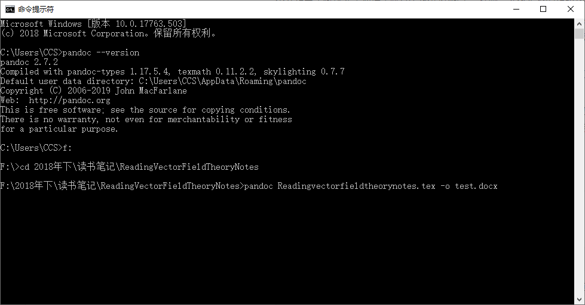


导出的word文件中公式以word自带公式编辑器表示，word文件不具有LaTeX模板的各种特效，只是保留结构文字、图片和公式。理论上来说，应付查重是足够的。

LaTeX公式例子

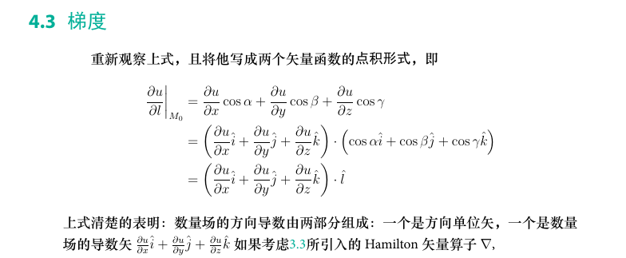

导出的word公式

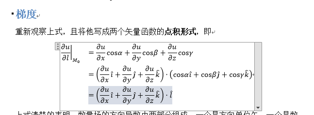